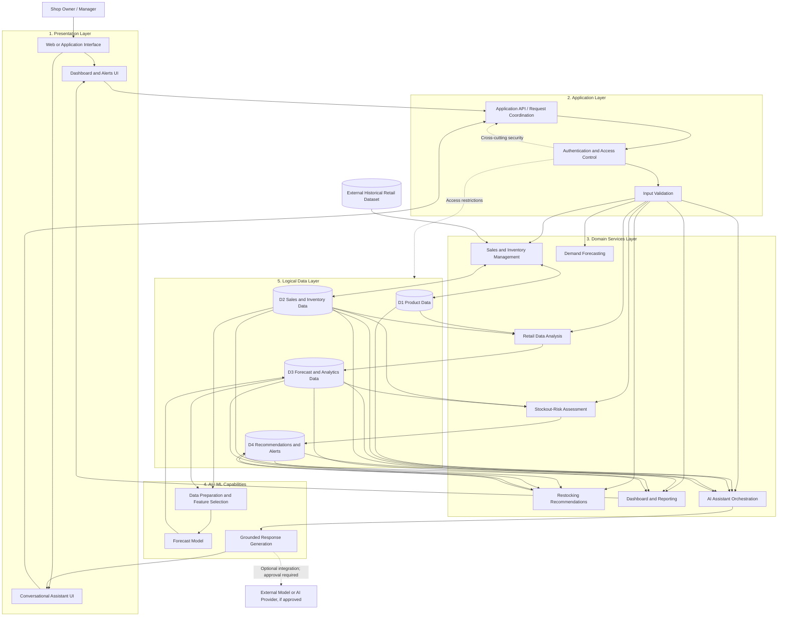

# M06-01 — Retail-X-AI Logical System Architecture

## Purpose

This diagram describes the proposed logical architecture of Retail-X-AI.
It separates user-facing functionality, application coordination, domain
services, AI/ML capabilities, data storage, and external data inputs.

The diagram is technology-neutral. It describes component responsibilities
and logical interactions rather than a confirmed deployment or technology stack.

## Architecture Diagram

## Interpretation

- The presentation layer provides dashboard, alert, and conversational interfaces.
- The application layer coordinates requests, validates inputs, and applies access
  controls before protected operations are performed.
- Domain services manage sales and inventory, analysis, forecasting, stockout
  assessment, restocking recommendations, reporting, and AI-assisted requests.
- AI/ML capabilities prepare suitable data, generate forecasts, and support
  responses grounded in retrieved system information.
- The logical data layer holds the four data-store categories identified in M05.
- The historical retail dataset is an external input. Any external model or AI
  provider is optional and requires an approved integration decision.

## Important Boundaries

This is a logical component view, not a deployment diagram. It does not specify
a programming language, web framework, cloud platform, database product, model
provider, network topology, or physical server arrangement.
