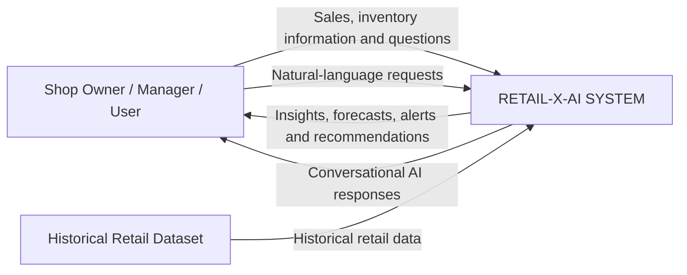

# M05-01 — System Context Diagram

## 1. Purpose

The System Context Diagram shows the boundary of the Retail-X-AI system and the main interactions between the system and its external entities.

Retail-X-AI is an AI-powered inventory demand forecasting and smart restocking system for local spaza shops.

## 2. External Entities

### Shop Owner / Manager / User

The Shop Owner / Manager / User:

- Provides sales and inventory information.
- Asks questions and makes requests.
- Receives sales and inventory insights.
- Receives demand forecasts.
- Receives stockout-risk alerts.
- Receives smart restocking recommendations.
- Interacts with the Conversational AI Assistant.

### Historical Retail Dataset

The Historical Retail Dataset provides historical retail data to Retail-X-AI for:

- Sales analysis
- Inventory analysis
- Demand forecasting
- AI/ML processing

## 3. System Context Diagram

## 4. Main Information Flows

| Source | Information | Destination |
|---|---|---|
| Shop Owner / Manager / User | Sales and inventory information | Retail-X-AI |
| Shop Owner / Manager / User | Questions and requests | Retail-X-AI |
| Historical Retail Dataset | Historical retail data | Retail-X-AI |
| Retail-X-AI | Sales and inventory insights | Shop Owner / Manager / User |
| Retail-X-AI | Demand forecasts | Shop Owner / Manager / User |
| Retail-X-AI | Stockout-risk alerts | Shop Owner / Manager / User |
| Retail-X-AI | Smart restocking recommendations | Shop Owner / Manager / User |
| Retail-X-AI | Conversational AI responses | Shop Owner / Manager / User |

## 5. System Boundary

### Outside the System

- Shop Owner / Manager / User
- Historical Retail Dataset

### Inside the System

All internal components and processes of Retail-X-AI are represented collectively by the **RETAIL-X-AI SYSTEM** in this context diagram.

The internal processes will be detailed in the subsequent DFD and system analysis artefacts.

## 6. Relationship to M05

This context diagram establishes the high-level system boundary for:

- M05-02 — DFD Level 0
- M05-03 — DFD Level 1
- M05-04 — Activity Diagrams
- M05-05 — Sequence Diagrams
- M05-06 — System Analysis Documentation