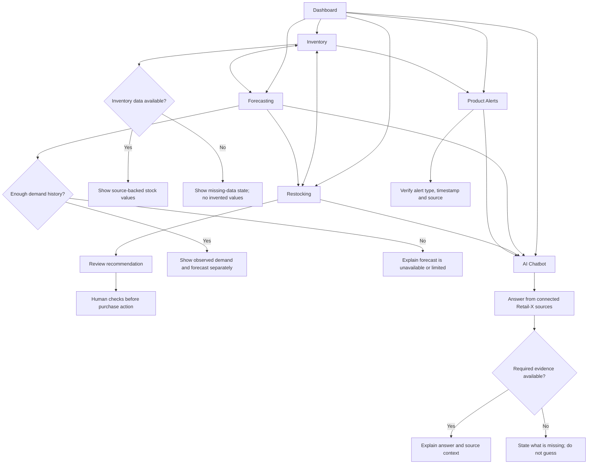

# M06-02 — Navigation Flow

## Shared navigation

Every screen uses the same left-hand navigation in this order: **Dashboard → Inventory → Forecasting → Restocking → Alerts → AI Chatbot**. The active destination is highlighted, and the chatbot remains directly accessible from every screen.

## Main interaction rules

- Dashboard provides a high-level entry point to all six areas.
- Inventory is the source for current stock and configured reorder thresholds. Unknown values remain visibly unknown.
- Forecasting separates historical observations from projected demand and communicates limited or missing history.
- Restocking recommendations are advisory and require human review before any order is placed.
- Alerts show the type, severity, source and timestamp when available. Expiry-related information must be verified against its source.
- The AI Chatbot can be opened from any screen. It should answer using connected Retail-X data, state relevant limitations, and never fabricate quantities, forecasts or events.
