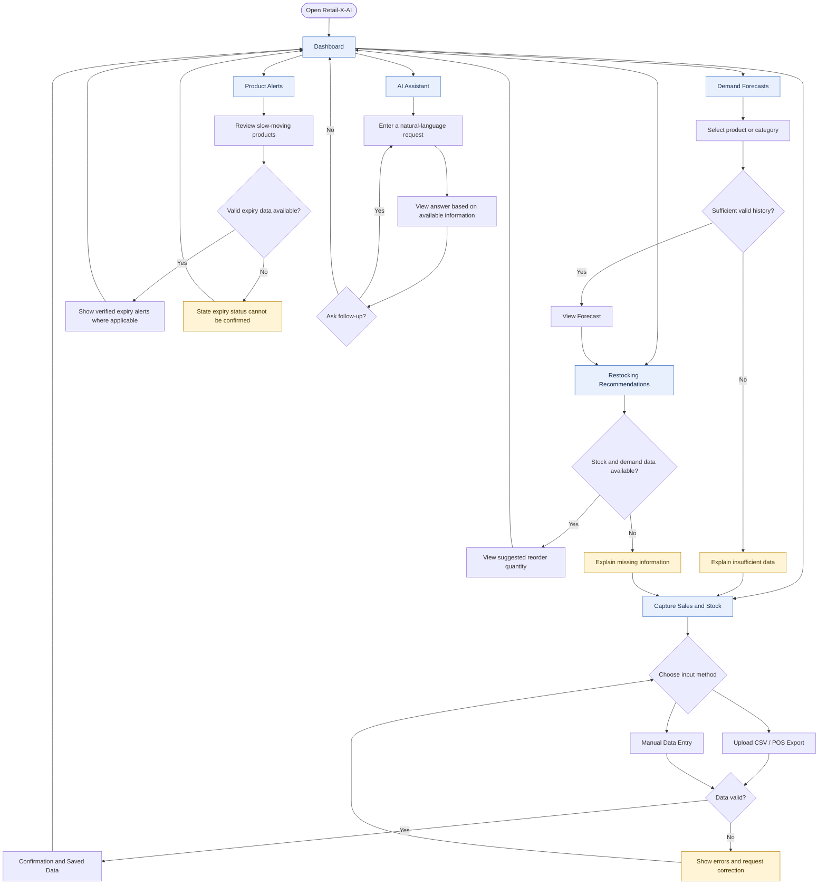

# M06-02 — Retail-X-AI Navigation Flow

## Purpose
Show how the Shop Owner / Manager navigates between the main Retail-X-AI functions.

## Primary navigation
- Dashboard
- Capture Sales and Stock
- Demand Forecasts
- Restocking Recommendations
- Product Alerts
- AI Assistant

## Navigation rules
- Keep the primary navigation available from every main screen.
- Provide a clear return to the Dashboard.
- Show validation errors beside the relevant data input.
- Never show a forecast or reorder quantity as confirmed when required data is missing.
- Never label a product as near expiry unless valid expiry data supports that status.
- The AI Assistant must explain when requested information is unavailable rather than inventing figures.
