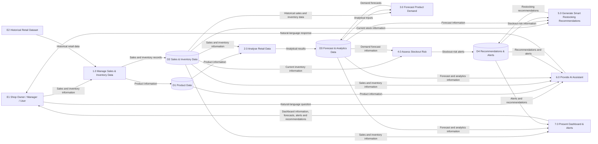

# M05-02 — Data Flow Diagram Level 0

## 1. Purpose

The Data Flow Diagram (DFD) Level 0 provides a high-level view of the main processes, external entities, data stores and information flows within the Retail-X-AI system.

Retail-X-AI is an AI-powered inventory demand forecasting and smart restocking system designed for local spaza shops.

The DFD Level 0 expands the system boundary established by the M05-01 System Context Diagram into the major functional processes of the system.

## 2. External Entities

### E1 — Shop Owner / Manager / User

The Shop Owner / Manager / User interacts with Retail-X-AI by providing sales and inventory information, requesting information from the system, and receiving forecasts, alerts, recommendations and dashboard information.

### E2 — Historical Retail Dataset

The Historical Retail Dataset provides historical retail information used by Retail-X-AI for data analysis and demand forecasting.

## 3. Main Processes

### 1.0 Manage Sales & Inventory Data

Captures, validates and stores sales and inventory information received from the user or available data sources.

### 2.0 Analyse Retail Data

Analyses available sales, inventory and product-related information to identify trends and information required by downstream forecasting and inventory processes.

### 3.0 Forecast Product Demand

Uses historical retail data and analytical inputs to generate demand forecasts for products or product categories.

### 4.0 Assess Stockout Risk

Uses current inventory information and demand-related information to identify products that may be at risk of stockout.

### 5.0 Generate Smart Restocking Recommendations

Uses forecast and inventory information to determine recommended reorder quantities and provide restocking recommendations.

### 6.0 Provide AI Assistant

Processes natural-language questions from the user and provides understandable responses using available inventory, sales, forecast and recommendation information.

### 7.0 Present Dashboard & Alerts

Presents sales trends, inventory information, demand forecasts, stockout alerts and restocking recommendations through the system interface.

## 4. Data Stores

### D1 — Product Data

Stores product-related information used by the Retail-X-AI system.

### D2 — Sales & Inventory Data

Stores captured sales and inventory information used for analysis and forecasting.

### D3 — Forecast & Analytics Data

Stores generated forecasts and relevant analytical results.

### D4 — Recommendations & Alerts

Stores or provides access to generated restocking recommendations and inventory-related alerts.

## 5. Main Data Flows

| Source | Data Flow | Destination |
|---|---|---|
| E1 — Shop Owner / Manager / User | Sales and inventory information | 1.0 Manage Sales & Inventory Data |
| E2 — Historical Retail Dataset | Historical retail data | 1.0 Manage Sales & Inventory Data |
| 1.0 Manage Sales & Inventory Data | Product information | D1 — Product Data |
| 1.0 Manage Sales & Inventory Data | Sales and inventory records | D2 — Sales & Inventory Data |
| D1 — Product Data | Product information | 2.0 Analyse Retail Data |
| D2 — Sales & Inventory Data | Sales and inventory information | 2.0 Analyse Retail Data |
| 2.0 Analyse Retail Data | Analytical results | D3 — Forecast & Analytics Data |
| D2 — Sales & Inventory Data | Historical sales and inventory data | 3.0 Forecast Product Demand |
| D3 — Forecast & Analytics Data | Analytical inputs | 3.0 Forecast Product Demand |
| 3.0 Forecast Product Demand | Demand forecasts | D3 — Forecast & Analytics Data |
| D2 — Sales & Inventory Data | Current inventory information | 4.0 Assess Stockout Risk |
| D3 — Forecast & Analytics Data | Demand forecast information | 4.0 Assess Stockout Risk |
| 4.0 Assess Stockout Risk | Stockout-risk alerts | D4 — Recommendations & Alerts |
| D2 — Sales & Inventory Data | Current stock information | 5.0 Generate Smart Restocking Recommendations |
| D3 — Forecast & Analytics Data | Forecast information | 5.0 Generate Smart Restocking Recommendations |
| D4 — Recommendations & Alerts | Stockout-risk information | 5.0 Generate Smart Restocking Recommendations |
| 5.0 Generate Smart Restocking Recommendations | Restocking recommendations | D4 — Recommendations & Alerts |
| E1 — Shop Owner / Manager / User | Natural-language question | 6.0 Provide AI Assistant |
| D1 — Product Data | Product information | 6.0 Provide AI Assistant |
| D2 — Sales & Inventory Data | Sales and inventory information | 6.0 Provide AI Assistant |
| D3 — Forecast & Analytics Data | Forecast and analytics information | 6.0 Provide AI Assistant |
| D4 — Recommendations & Alerts | Recommendations and alerts | 6.0 Provide AI Assistant |
| 6.0 Provide AI Assistant | Natural-language response | E1 — Shop Owner / Manager / User |
| D2 — Sales & Inventory Data | Sales and inventory information | 7.0 Present Dashboard & Alerts |
| D3 — Forecast & Analytics Data | Forecast and analytics information | 7.0 Present Dashboard & Alerts |
| D4 — Recommendations & Alerts | Alerts and recommendations | 7.0 Present Dashboard & Alerts |
| 7.0 Present Dashboard & Alerts | Dashboard information, forecasts, alerts and recommendations | E1 — Shop Owner / Manager / User |

## 6. DFD Level 0 Diagram

## 7. Scope and Data Limitations

The DFD represents the logical information flows required by the system requirements.

The current team dataset contains:

- Date
- Store ID
- Product ID
- Category
- Region
- Inventory Level
- Units Sold
- Units Ordered
- Demand Forecast
- Price
- Discount
- Weather Condition
- Holiday/Promotion
- Competitor Pricing
- Seasonality

The current dataset does not directly contain:

- Supplier lead-time information
- Product expiry dates
- Customer profiles

Therefore, the DFD does not represent these unavailable fields as existing dataset fields.

Supplier lead time and expiry information may require additional user input or another approved data source if these requirements are implemented.

## 8. Relationship to M05-01

M05-01 defines the high-level system boundary and external interactions.

M05-02 expands that boundary into the major internal processes and data stores required for the system.

The Level 0 DFD provides the foundation for the more detailed M05-03 DFD Level 1.

## 9. Verification

The DFD Level 0 was designed against:

- The M05-01 System Context Diagram.
- The functional requirements FR-01 to FR-06.
- The M04-04 use-case specifications.
- The M04-05 Requirements Traceability Matrix.

The diagram contains:

- 2 external entities.
- 7 major processes.
- 4 data stores.
- Defined data flows between external entities, processes and data stores.

No unavailable dataset fields are represented as existing fields in the current team dataset.
