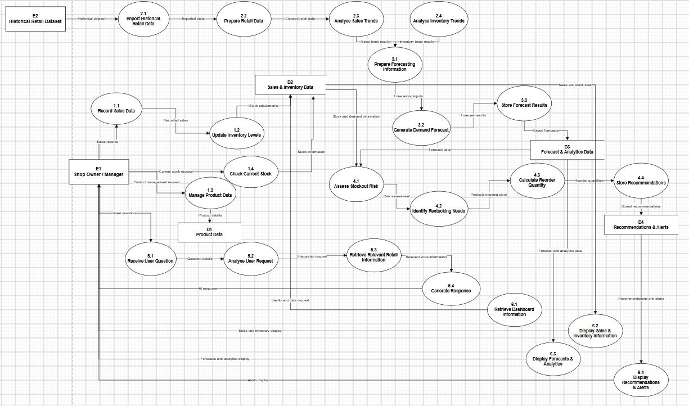

# M05-03 — Data Flow Diagram Level 1

## 1. Purpose

The Level 1 Data Flow Diagram (DFD) decomposes the main processes shown in the Retail-X-AI Level 0 DFD into smaller processes. It explains how retail data moves through the system to support demand forecasting, stockout-risk assessment, smart restocking, AI-assisted queries, and dashboard reporting.

Retail-X-AI is intended to support local spaza shop owners and managers with inventory decisions. It provides decision support; the shop owner or manager remains responsible for confirming purchasing and restocking decisions.

## 2. Diagram

## 3. External entities

| Entity | Responsibility |
|---|---|
| E1 — Shop Owner / Manager | Records or requests sales and inventory information, asks the AI assistant questions, and receives forecasts, dashboard information, recommendations, and alerts. |
| E2 — Historical Retail Dataset | Supplies historical retail records for import, preparation, analysis, and demand forecasting. |

The diagram represents the dataset as an input to the system. The availability and quality of its fields determine which analyses can be performed reliably.

## 4. Process decomposition

### 4.1 Sales and inventory management — Process group 1.x

| Process | Description |
|---|---|
| 1.1 Record Sale Data | Captures sales information supplied by the shop or an integrated sales source. |
| 1.2 Update Inventory Levels | Updates stock information after recorded sales or other inventory changes. |
| 1.3 Manage Product Data | Maintains product information used by inventory and retail analysis functions. |
| 1.4 Check Current Stock | Retrieves available stock information to support stock checks and restocking decisions. |

### 4.2 Retail data preparation and analysis — Process group 2.x

| Process | Description |
|---|---|
| 2.1 Import Historical Retail Data | Imports historical records from the selected retail dataset. |
| 2.2 Prepare Retail Data | Prepares and checks the imported records before analysis. |
| 2.3 Analyse Sales Trends | Examines historical sales patterns and product demand behaviour. |
| 2.4 Analyse Inventory Trends | Examines inventory patterns to support stock monitoring and decision-making. |

### 4.3 Demand forecasting — Process group 3.x

| Process | Description |
|---|---|
| 3.1 Prepare Forecasting Information | Selects and prepares suitable historical information for the forecasting process. |
| 3.2 Generate Demand Forecast | Produces estimated future demand for products. |
| 3.3 Store Forecast Results | Makes forecast results available for later risk assessment, recommendations, and dashboard display. |

The initial forecasting target is `Units Sold`. The existing data-analysis documentation identifies `Demand Forecast`, `Units Ordered`, and `Inventory Level` as potential leakage risks for the initial demand-forecast model. They must not automatically be treated as valid forecasting inputs merely because they appear in the dataset. Inventory information may still be used separately for stock monitoring and restocking logic where appropriate.

### 4.4 Stockout-risk assessment and smart restocking — Process group 4.x

| Process | Description |
|---|---|
| 4.1 Assess Stockout Risk | Uses available stock and demand-related information to identify potential stockout risk. |
| 4.2 Identify Restocking Needs | Identifies products that may need replenishment. |
| 4.3 Calculate Reorder Quantity | Calculates a suggested reorder quantity using available demand and inventory information. |
| 4.4 Store Recommendations | Stores or makes restocking recommendations available to the dashboard and shop user. |

Recommendations are decision support, not automatic purchase orders. Supplier lead time is not available in the selected dataset; if the final reorder calculation requires it, the value must be supplied separately or obtained from an approved source. The system must not invent it.

### 4.5 AI assistant — Process group 5.x

| Process | Description |
|---|---|
| 5.1 Receive User Question | Receives a question or request from the shop owner or manager. |
| 5.2 Analyse User Request | Interprets the request to determine the information or assistance required. |
| 5.3 Retrieve Relevant Retail Information | Retrieves relevant product, sales, inventory, forecast, or recommendation information when available. |
| 5.4 Generate Response | Produces a response grounded in the information available to the system. |

The assistant is intended to support inventory-related questions and broader shopping-planning requests where suitable information is available. It must distinguish verified product or price information from suggestions and must not invent stock levels, prices, expiry dates, or other unavailable facts.

### 4.6 Dashboard and reporting — Process group 6.x

| Process | Description |
|---|---|
| 6.1 Retrieve Dashboard Information | Retrieves the information required for the dashboard. |
| 6.2 Display Sales and Inventory Information | Presents relevant sales and stock information. |
| 6.3 Display Forecasts and Analytics | Presents demand forecasts and analytical results. |
| 6.4 Display Recommendations and Alerts | Presents restocking recommendations and relevant inventory alerts. |

The dashboard brings together information produced by the system so that the shop owner or manager can make informed decisions.

## 5. Data stores

| Data store | Purpose |
|---|---|
| D1 — Product Data | Holds product information used by inventory management and analysis. |
| D2 — Sales and Inventory Data | Holds recorded sales and stock information. |
| D3 — Forecast and Analytics Data | Holds or provides access to forecast results and analytical information. |
| D4 — Recommendations and Alerts | Holds or provides access to restocking recommendations and inventory alerts. |

These are logical data stores in the analysis diagram. Their final database tables and relationships must be confirmed during database design, based on the approved requirements and data model.

## 6. Main data-flow sequence

1. Historical retail records are imported into the system.
2. Imported records are prepared and analysed for sales and inventory trends.
3. Suitable historical information is passed to the demand-forecasting process.
4. Forecast results are made available to stockout-risk assessment and restocking logic.
5. The system assesses stock risk, identifies potential restocking needs, and calculates suggested quantities using available information.
6. The AI assistant receives questions and retrieves relevant system information before generating a response.
7. The dashboard presents sales and inventory information, forecasts, recommendations, and alerts to the shop owner or manager.

The diagram shows logical information flows; it does not imply that all processes have already been implemented or integrated.

## 7. Dataset limitations and assumptions

The selected dataset is stored in the repository at `dataset/raw/retail_store_inventory.csv`. The data-analysis documentation must remain the source of truth for the verified column names, profiling results, and modelling decisions.

- **Expiry monitoring:** The selected dataset does not provide product expiry dates. Actual near-expiry alerts require additional expiry-date data.
- **Supplier lead time:** Supplier lead times are not provided. Reorder calculations that depend on lead time require an additional verified input.
- **Forecasting:** `Units Sold` is the initial prediction target. Potential leakage fields must be excluded from the initial forecasting inputs in line with the data-analysis documentation.
- **Stock monitoring:** Inventory information may support separate stock checks and stockout-risk logic; excluding a field from the forecasting model does not mean it can never be used by another system function.
- **Data quality:** Forecast and recommendation reliability depends on the quality, coverage, and suitability of the supplied retail records.
- **Human oversight:** Forecasts and reorder quantities are recommendations. The shop owner or manager makes the final decision.
- **AI responses:** Answers must be grounded in available data. Missing information must be disclosed rather than fabricated.

## 8. Relationship to other project artefacts

- **Level 0 DFD:** Shows the system's main processes, external entities, data stores, and high-level data flows.
- **Requirements documentation:** Defines the required system behaviour and functional requirements.
- **Use-case specifications:** Describe interactions between the shop user and the system.
- **Data-analysis documentation:** Records dataset profiling, the forecasting target, leakage risks, assumptions, and limitations.
- **Database design:** Will translate approved logical data requirements into a database schema.

## 9. Verification checklist

- [ ] Confirm the diagram matches the latest Level 1 PNG in the repository.
- [ ] Confirm process names and numbering are consistent with the diagram.
- [ ] Confirm the dataset limitations agree with the data-analysis documentation.
- [ ] Confirm references to requirements and use cases point to the current repository files.
- [ ] Review the document with the project team before merging.
